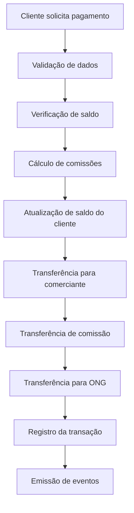

# 🚀 Sistema de Pagamento Blockchain

Um sistema completo de pagamentos descentralizado construído com Ethereum, Flask e Web3.py, permitindo transações seguras entre clientes com suporte a conversão BRL/ETH.

## ✨ Funcionalidades

### 🔐 Gestão de Clientes
- **Registro de usuários** com criação automática de carteiras Ethereum via Ganache
- **Autenticação segura** com hash de senhas
- **Gerenciamento de saldo** em ETH com conversão para BRL em tempo real
- **Referências PIX** para identificação única de usuários

### 💳 Sistema de Pagamentos
- **Pagamentos instantâneos** entre clientes ou para ONGs
- **Conversão automática** BRL → ETH para facilitar transações
- **Sistema de comissões** para comerciante, ONGs e clientes
- **Doações diretas** para ONGs relacionadas

### 📊 Monitoramento e Controle
- **Consulta de saldos** em tempo real
- **Sistema de bônus** baseado no volume de transações
- **Dashboard administrativo** para gerenciamento da plataforma

## 🏗️ Arquitetura do Sistema

### Backend API (Flask)
```
📂 API Flask
├── 🔗 Integração Web3.py
├── 💱 Conversão de moedas (BRL/ETH)
├── 🔐 Gestão de carteiras
```

### Smart Contracts (Solidity)
```
📂 Contratos Inteligentes
├── 👥 SistemaCliente.sol - Gestão de usuários
├── 💰 NewEther.sol - Processamento de pagamentos
└── 🔗 Interface de comunicação entre contratos inteligentes
```

### Blockchain Infrastructure
```
📂 Infraestrutura
├── 🌐 Ganache (Testes e Atribuição de Contas)
├── 🗄️ MySQL (Dados de Clientes e de Transações)
└── 🔗 Web3.py (Integração Python-Ethereum)
```

## 🛠️ Tecnologias Utilizadas

| Categoria | Tecnologia | Versão | Descrição |
|-----------|------------|---------|-----------|
| **Backend** | Flask | 2.x | Framework web Python |
| **Blockchain** | Solidity | ^0.8.19 | Linguagem para smart contracts |
| **Integração** | Web3.py | 6.x | Biblioteca Python para Ethereum |
| **Desenvolvimento** | Ganache | 7.x | Blockchain local para testes |
| **Banco de Dados** | MySQL | 8.x | Armazenamento de dados auxiliares |
| **Criptografia** | eth-account | 0.8.x | Gerenciamento de contas Ethereum |

## 📋 Pré-requisitos

- Python 3.8+
- MySQL 8.0+
- Ganache CLI ou GUI

## 🚀 Instalação e Configuração

### 1. Clone o repositório
```bash
git clone https://github.com/Felipe-Tagawa/Cryp2Real.git
cd Cryp2Real
```

### 2. Instale as dependências Python
```bash
pip install -r requirements.txt
```

### 3. Configure o ambiente
```bash
# Crie um arquivo .env na raiz do projeto
cp .env.example .env
```

### 4. Configure o MySQL
```sql
CREATE DATABASE blockchain_payments;
-- Execute os scripts SQL de criação das tabelas
```

### 5. Inicie o Ganache
```bash
# Via CLI
ganache-cli --deterministic --accounts 10 --host 0.0.0.0 --port 7545

# Ou use o Ganache GUI - Crie 100 contas com 200 ETH cada(tolerância existente para contas)
```

### 6. Baixe o Ngrok e pegue o autenticador

### Instale o Ngrok e autentique com seu token
ngrok config add-authtoken YOUR_AUTHTOKEN -- Esse AUTHTOKEN é individual

### Inicie um túnel para a porta da aplicação - no nosso caso usaremos a porta 5000
```ngrok
ngrok http 5000
```

### 7. Deploy dos contratos
```bash
python deploy_contract.py
```

### 8. Inicie a aplicação
```bash
python app.py
```

## 📚 Endpoints da API

### 👥 Gestão de Clientes

#### `POST /registrarCliente`
Registra um novo cliente no sistema
```json
{
  "nome": "João Silva",
  "referenciaPix": "joao@email.com",
  "email": "joao@email.com",
  "senha": "minhasenha123"
}
```

#### `GET /mostraInfoCliente?carteira=0x...`
Retorna informações detalhadas do cliente
```json
{
  "nome": "João Silva",
  "email": "joao@email.com",
  "referenciaPix": "joao@email.com",
  "saldo": {
    "wei": "1000000000000000000",
    "eth": "1.0",
    "reais": 18000.00
  },
  "cotacao_eth_brl": 18000.00
}
```

### 💰 Operações Financeiras

#### `POST /adicionaSaldo`
Adiciona saldo à conta do cliente
```json
{
  "carteira": "0x742d35Cc6634C0532925a3b8D404D0C18b5a4b2F",
  "valor_reais": 100.00
}
```

#### `POST /realizaPagamento`
Processa pagamento entre cliente e comerciante
```json
{
  "valor_reais": 50.00,
  "referenciaPix": "joao@email.com",
  "comerciante": "0x8ba1f109551bD432803012645Hac136c9c66fbbf"
}
```

## 🔒 Segurança

### Smart Contracts
- **Modifier de reentrância** para prevenir ataques
- **Validação de endereços** em todas as transações
- **Controle de acesso** baseado em roles
- **Hash seguro de senhas** com salt baseado no endereço

### API
- **Validação rigorosa** de todos os inputs
- **Tratamento de erros** abrangente
- **Logging** de todas as operações sensíveis

## 🎯 Fluxo de Pagamento



## 🔧 Configuração de Desenvolvimento

### Estrutura de Pastas
```
projeto/
├── app.py                    # Aplicação Flask principal
├── my_blockchain.py          # Configurações Web3
├── utils.py                  # Funções utilitárias
├── reset_accounts.py         # Realiza o reset de contas
├── accounts_control.json     # Mostra as contas utilizadas
├── deploy_contract.py        # Deploy dos contratos
├── deploy_output             # Saída dos contratos
├── contracts/                # Smart Contracts
│   ├── SistemaCliente.sol    # Smart Contract de controle de clientes
│   └── NewEther.sol          # Smart Contract de controle de transações
├── DAO/                      # Arquivos de config do banco de dados
│   ├── clientesDAO.py        # Classe de conexão do usuário com o python
│   ├── configBD.py           # Classe de configuração do banco de dados local
│   ├── connectionDAO.py      # Classe de integração com o banco de dados local

Demais arquivos: rodar o projeto na web (futuras atualizações)
```

### Variáveis de Ambiente
```env
# Blockchain
GANACHE_URL=http://127.0.0.1:7545
PRIVATE_KEY= # Private Key da primeira conta do seu ganache

# Database
MYSQL_HOST=localhost
MYSQL_PORT=3306
MYSQL_USER=root
MYSQL_PASSWORD=root
MYSQL_DATABASE=blockchain_payments

# API
FLASK_ENV=development
FLASK_DEBUG=True
API_BASE_URL=http://localhost:5000
```

## 📈 Monitoramento e Logs

### Eventos do Smart Contract
- `novoClienteRegistrado`: Novo cliente cadastrado
- `PagamentoRecebido`: Pagamento processado com sucesso
- `doacaoRealizada`: Doação efetuada para ONG

### Métricas Importantes
- Volume total de transações
- Valor médio por transação
- Taxa de conversão BRL/ETH
- Comissões arrecadadas

---

👥 Equipe de Desenvolvimento

Este projeto foi desenvolvido por:

Felipe Silva Loschi - Integração Blockchain e FlutterFlow

Felipe Tagawa Reis - Desenvolvimento Backend e Smart Contracts

Pedro Henrique Ribeiro Dias - Arquitetura do Sistema e Banco de Dados
